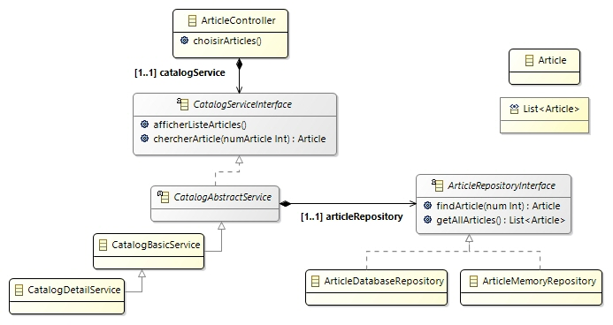
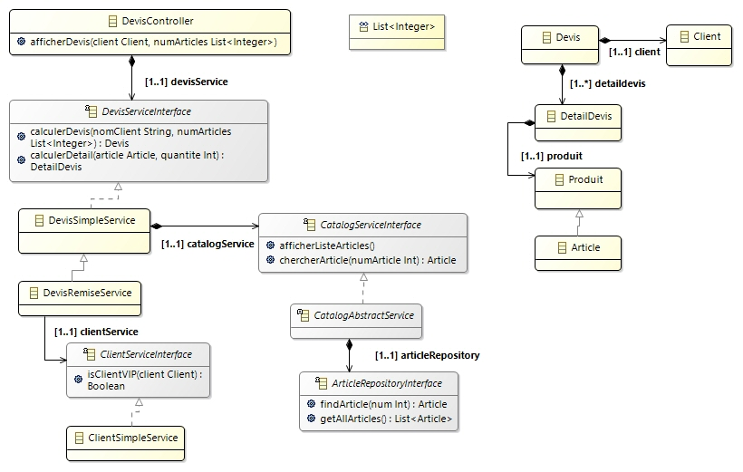

## Branche 02_springcore_ioc_démarrage

### 1. Initialisation 

> **Spring initializr** à l'adresse [https://start.spring.io/](https://start.spring.io/)

Renseigner le formulaire
- Projet maven
- Langage Java
- SpringBoot version 2.3.4
- Métadonnées maven

```
	- Group:     net.jmb.tuto.spring
	- Articfact: 01-spingcore-ioc
	- Package:   net.jmb.tuto.spring
	- Packaging: Jar
	- Java:      8
```

Une fois le projet généré, le dézipper dans le répertoire de formation.
Puis l'importer en tant que projet maven

### 2. Projet maven

Maven est un outil de build (construction) des projets java.
Il a été développé par la fondation Apache dans le but de standardiser et d'automatiser le process de fabrication.
- Compilation, tests unitaires, déploiement : précieux pour l'intégration continue.
- S'appuie sur un fichier de configuration pom.xml qui a la particularité de recenser les dépendances vis-à-vis des librairies requises.
- La gestion des dépendances utilise un système de dépôts locaux et distants.
- Dépôt distant de référence : [Central Repository](https://mvnrepository.com/repos/central)
- Guide utilisateur de référence : [Maven Getting Started](http://maven.apache.org/guides/getting-started/index.html) 

> **Le projet généré par Spring initializr est un projet maven qui référence toutes les dépendances vers les librairies nécessaires à l'utilisation du framework**

> Il s'agit d'un template (modèle) d'application SpringBoot préconfigurée et prête à l'emploi 

## Branche 03_création_des_contrôleurs (principe de responsabilité unique)

### 1. Déplacement du code d'interaction avec les utilisateurs dans les contrôleurs

Dans la classe **`Application.java`** ne figure plus que le code responsable du flot d'exécution
- Instanciation des classes d'implémentation en fonction du contexte
- Mise en relation des objets par injection de dépendances

**net.jmb.tuto.spring.Application**

```java
	...
	// On identifie le client
	ClientController clientController = new ClientController();
	Client client = clientController.identifierClient();

	// On propose un choix dans la liste des articles disponibles
	ArticleController articleController = new ArticleController();
	articleController.setCatalogService(catalogService);
	List<Integer> numArticles = articleController.choisirArticles();

	// On renvoie le devis correspondant
	DevisController devisController = new DevisController();
	devisController.setDevisService(devisService);
	devisController.afficherDevis(client, numArticles);
	...
```

### 2. Diagramme de classes schématisé

Au final, les diagrammes ci-dessous font apparaître les dépendances entre composants de l'application

- **Diagramme de classes sur la fonctionnalité 'catalogue'**



- **Diagramme de classes sur la fonctionnalité 'devis'**




